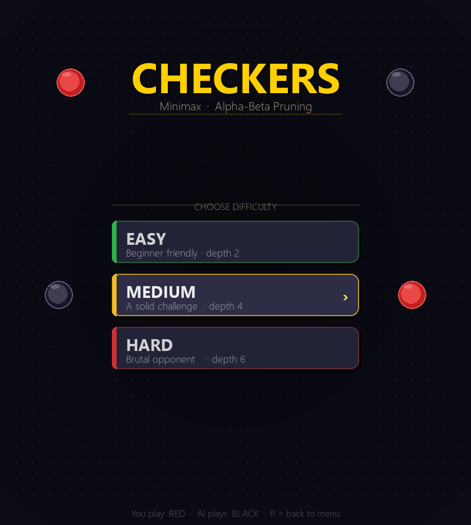
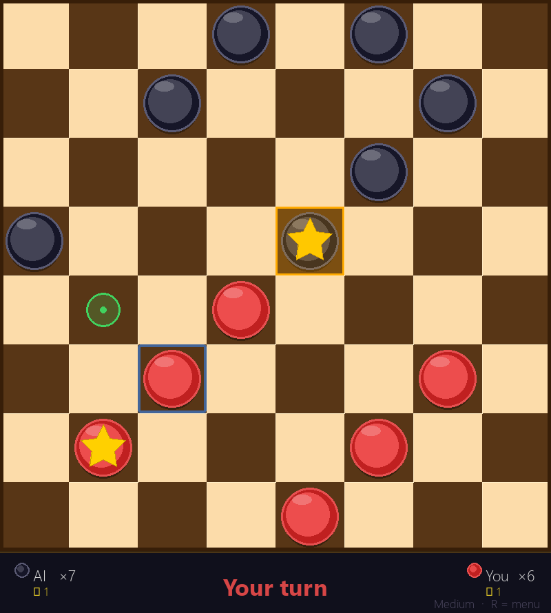
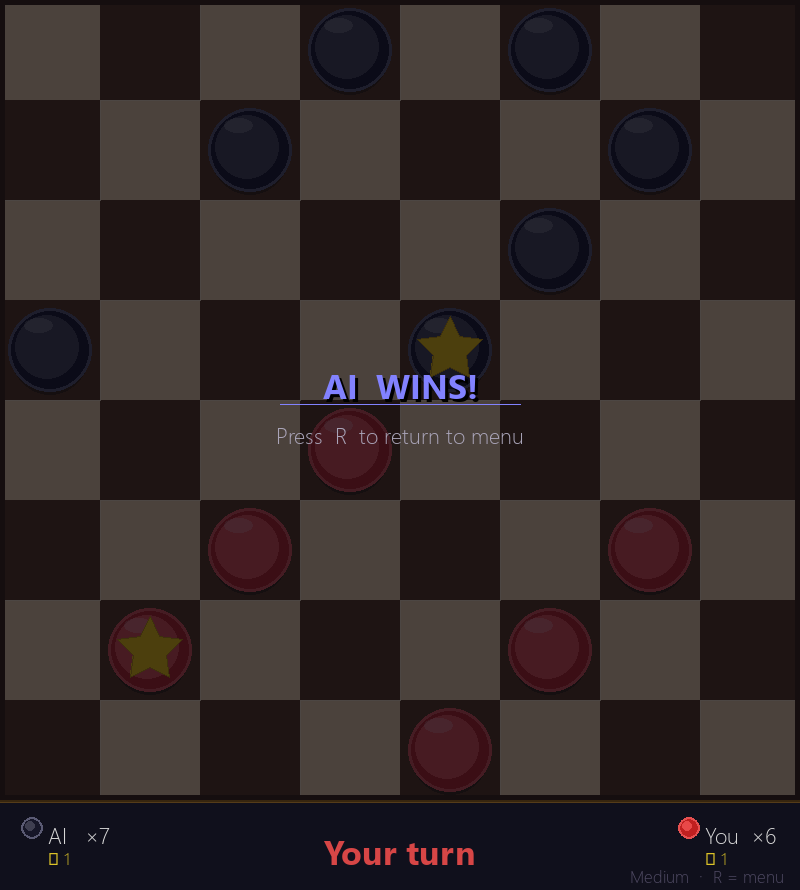

# Checkers — Minimax AI with Alpha-Beta Pruning

A fully playable checkers game where you face an AI opponent powered by the **Minimax algorithm** with **Alpha-Beta Pruning**. Built with Python and Pygame.

---

## Screenshots

### Difficulty Menu


### Gameplay


### Game Over


---

## Features

- **Minimax AI** with configurable search depth
- **Alpha-Beta Pruning** — prunes irrelevant branches, allowing depth-6 search in real time
- **Rich evaluation function** — weighs material, board position, piece advancement, and mobility
- **Full checkers rules** — mandatory captures, multi-jump chains, king promotion
- **Stalemate detection** — player with no legal moves loses
- **Three difficulty levels** — Easy (depth 2), Medium (depth 4), Hard (depth 6)
- **Polished UI** — 3-D piece rendering, shine highlights, pulsing selection, animated dots during AI thinking, last-AI-move highlight

---

## How the AI Works

### Minimax
The AI searches the game tree by recursively exploring all possible moves up to a fixed depth. **RED maximises** the score; **BLACK (AI) minimises** it. At each leaf node the position is scored by the evaluation function.

```
minimax(position, depth, is_maximising):
    if depth == 0 or game over:
        return evaluate(position)

    if is_maximising:             # RED's turn
        best = -∞
        for each move:
            best = max(best, minimax(child, depth-1, False))
        return best
    else:                         # BLACK's turn (AI)
        best = +∞
        for each move:
            best = min(best, minimax(child, depth-1, True))
        return best
```

### Alpha-Beta Pruning
Pruning avoids exploring branches that can never affect the final decision:

- **α** — the best score MAX can already guarantee
- **β** — the best score MIN can already guarantee
- If **β ≤ α**, the remaining children are skipped (they won't be chosen)

This reduces the effective branching factor from ~10 to ~3–4, allowing **depth 6** search in under a second.

### Evaluation Function
Each board position is scored as `red_score − black_score`, where each side's score combines:

| Factor | Detail |
|--------|--------|
| Material | Regular piece = 1.0 · King = 1.5 |
| Position | Centre squares score up to +0.5; edge squares +0.3 |
| Advancement | Non-kings gain +0.05 per row closer to promotion |
| Mobility | Each available move adds +0.1 (avoids getting trapped) |

### Move Ordering
Captures are always explored before quiet moves. Quiet moves are sorted by positional weight (best squares first). This improves pruning efficiency significantly.

---

## Installation

**Requirements:** Python 3.8+ and Pygame

```bash
pip install pygame
```

**Clone & run:**

```bash
git clone https://github.com/your-username/checkers-minimax-alpha-beta-pruning.git
cd checkers-minimax-alpha-beta-pruning
python main.py
```

---

## How to Play

| Action | Input |
|--------|-------|
| Select a piece | Left-click a red piece |
| Move / capture | Left-click a highlighted green dot |
| Deselect | Left-click another red piece |
| Return to menu | Press `R` |

- You play **RED** (bottom). The AI plays **BLACK** (top).
- Captures are **mandatory** — if a jump is available, only jump moves are shown.
- Pieces reaching the opposite back row become **Kings** (gold star) and can move in all four directions.
- The game ends when a player loses all pieces or has no legal moves.

---

## Project Structure

```
checkers-minimax-alpha-beta-pruning/
├── main.py           # Entry point — game loop, event handling
├── game.py           # Game state, turn management, rendering
├── board.py          # Board + Piece classes, move generation
├── minimax.py        # Minimax with alpha-beta pruning & evaluation
├── menu.py           # Difficulty selection screen
├── constants.py      # Colors, dimensions
├── capture_screenshots.py  # Utility — generates README screenshots
└── screenshots/
    ├── menu.png
    ├── gameplay.png
    └── gameover.png
```

---

## Complexity

| | Plain Minimax | With Alpha-Beta |
|---|---|---|
| Nodes explored (depth 6) | ~10⁶ | ~10³–10⁴ |
| Effective branching factor | ~10 | ~3–4 |
| Response time (depth 6) | Several seconds | < 1 second |

---

## Tech Stack

- **Python 3.12**
- **Pygame 2.x**
